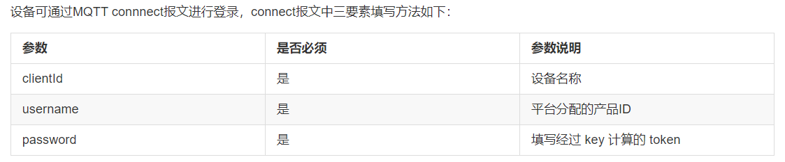

# 简介

本上云实记针对AI-Thinker ESP32-S
开发板对接OneNet新版云平台的上云流程记录。主要针对设备侧（南向）和云端控制台设置，未对应用侧（北向）做深入工作，仅供参考。

本实记规定使用MQTT协议进行设备上云并管理，开发板使用AT指令进行网络配置，并使用透传模式发送符合MQTT协议的内容，对支持AT指令但不支持MQTT协议的设备具有较大的参考意义。

# ONENET云端控制台配置

新版OneNet云端控制台的配置主要分为以下几步：

1. 产品与设备的创建
2. 记录设备连接需要的信息

## 产品与设备的创建

### 添加（创建）产品

1. 进入控制台首页，从左边的菜单栏选择设备接入与管理——产品管理，点击添加产品

   
2. 根据下图中的各项配置选择/输入产品的信息，完成后点击确定

   
3. 产品创建完成后，在产品管理界面的产品列表会出现创建的产品

   

### 创建（添加）设备

1. 从左侧菜单进入设备管理界面，点击添加设备

   
2. 根据下图中的各项配置选择/输入设备的信息，完成后点击确定

   
3. 设备创建完成后，在设备管理界面的设备列表会出现创建的设备

   

### 为产品设置物模型

1. 从左侧菜单进入产品管理界面，点击产品列表中新建产品的详情

   
2. 点击右侧的设置物模型

   
3. 点击添加自定义功能点

   
4. 根据下图中的各项配置选择/输入功能点的信息，完成后点击添加

   
5. 功能点添加完成后，在物模型管理界面的功能列表会出现添加的功能点描述，点击保存

   
6. 出现提示，点击保存即可

   
7. 提示保存成功，点击关闭

   

   

## 记录设备连接需要的信息

需要记录的信息包括设备名称，产品ID，通过设备密钥（key）计算得到的token字符串。

该信息主要作为连接OneNet云服务器时发送mqtt通信中的connect数据包中的参数。

OneNet云对其定义如下：

详情见[参考资料](#_参考资料)中的链接1

### 设备名称

设备名称可以直接在控制台左侧菜单点击进入设备管理界面，从设备列表获得

### 产品ID

在设备列表中点击详情

在设备信息栏中即可看到设备所属产品的产品ID

### Token字符串

有关token字符串的详细介绍可以前往[参考资料](#_参考资料)的链接2了解

设备密钥在设备信息栏中点击展开即可获取

获得设备密钥后，我们需要下载、安装、使用OneNet官方提供的token生成工具，下载链接参考[工具说明](#_工具说明)的链接1

除了OneNet官方提供的token生成工具，可以参考OneNet官方提供的token生成算法解释或使用官方提供python代码段生成token，详情参考参考资料中的链接3

打开token生成工具，进入如下界面

有关token生成参数的OneNet官方定义如下：

| **名称** | **类型** | **是否必须** | **参数说明**                                                                                                      | **参数示例**                                 |
| -------- | -------- | ------------ | ----------------------------------------------------------------------------------------------------------------- | -------------------------------------------- |
| version  | string   | 是           | 参数组版本号，日期格式，目前仅支持"2018-10-31"                                                                    | 2018-10-31                                   |
| res      | string   | 是           | 访问资源 resource格式为：products/{产品id}/devices/{设备名字}                                                     | products/dafdfadfafdaf/devices/che1          |
| et       | int      | 是           | 访问过期时间 expirationTime，unix时间当一次访问参数中的et时间小于当前时间时，平台会认为访问参数过期从而拒绝该访问 | 1537255523表示：北京时间 2018-09-18 15:25:23 |
| method   | string   | 是           | 签名方法 signatureMethod支持hmacmd5、hmacsha1、hmacsha256                                                         | sha1（代表使用hmacsha1算法）                 |
| sign     | string   | 是           | 签名结果字符串signature                                                                                           | rBYeJXTp2q4V3C2aj4DBzjaydcw%3D               |

其中et的生成参考工具说明的链接2，只需要将时间设置为50年后，该token就可以使用50年。

token生成参数中的key使用我们获得的设备密钥，此处参考官方论坛中内部员工的解释

详见[参考资料](#_参考资料)中的链接4

将token所需参数填入计算工具，获得token值

### 信息整理

至此我们获得了设备与OneNet云建立Mqtt连接的Connect数据包中的参数如下：

| **类型** | **内容**                                                                                                                                                  | **长度** |
| -------- | --------------------------------------------------------------------------------------------------------------------------------------------------------- | -------- |
| clientId | D\_Mqtt_1                                                                                                                                                  | 8        |
| username | Ywsx1Okw32                                                                                                                                                | 10       |
| password | 
version=2018-10-31&res=products%2FYwsx1Okw32%2Fdevices%2FD_Mqtt_1&et=2561396583&method=md5&sign=9V%2FBR0a8GTMkQhYXwXq9DQ%3D%3D | 126      |

# 设备设置与通信

## 简介

本实记使用的上云设备为烧录了AT指令固件包的AI-Thinker ESP32-S 开发板。

所使用的固件为安信可ESP32-S
出厂默认AT固件，下载链接参考[工具说明](#_工具说明)链接3。

电脑连接设备的两个串口，包括开发板板载的USB转串口的调试串口与通过串口转化模块（CH340）连接指定GPIO引脚的AT控制串口。

使用的串口调试工具为XCOM
V2.6，为正点原子开发的串口调试工具，在正点原子论坛可以下载。下载链接参考[工具说明](#_工具说明)链接4。使用串口调试工具发送AT指令时，需要勾选发送新行。

有关AT指令的说明文档详见[工具说明](#_工具说明)中的链接5

设备设置与通信分为设备网络设置以及设备通信两部分

## 设备网络设置

首先使用AT测试设备是否正常工作，返回OK则表示设备正常接收AT指令

发送AT+CWMODE=1设置设备为Station模式，返回OK表示设置成功

使用接入广域网的手机热点或将路由器，并将其AP名称和密码改为

AP名称：mqttTestWifi

AP密码：mqttmqtt

发送AT+CWJAP="mqttTestWifi","mqttmqtt"使设备连接到AP，返回如下内容则表示连接与获取IP成功。

## 设备通信

接入广域网的设备需要与OneNet云服务器进行MQTT通信需要执行下列步骤

1. 与OneNet云服务器进行TCP透传连接
2. 发送Connect数据包执行MQTT连接

### 与OneNet云服务器进行TCP透传连接

OneNet云服务器对MQTT设备的服务地址为

| **连接协议** | **证书**                                                                                               | **地址**        | **端口** | **说明**   |
| ------------ | ------------------------------------------------------------------------------------------------------ | --------------- | -------- | ---------- |
| MQTT         | [证书下载](https://open.iot.10086.cn/doc/iot_platform/images/iot_platform/mqtts/MQTTS-certificate.zip) | 183.230.102.116 | 8883     | 加密接口   |
| MQTT         | -                                                                                                      | 218.201.45.7    | 1883     | 非加密接口 |

详见[参考资料](#_参考资料)中的链接1

另外，官方还给出一个不同IP的域名地址也可以给MQTT设备提供服务。

该域名为：mqtt.heclouds.com

通过DNS解析后得到的IP地址为：183.230.40.39

使用的非加密端口同样为1883

详见[参考资料](#_参考资料)中的链接5

测试使用非加密端口

因此发送AT+CIPSTART="TCP","218.201.45.7",1883使设备与OneNet云服务器进行TCP连接，提示下列内容则表明已经建立连接

发送AT+CIPMODE=1设置设备为透传模式，返回0K则表示设置成功

发送AT+CIPSEND设置设备开始发送透传数据，此时窗口上会出现右三角括号符号，表示设置成功

### 发送CONNECT数据包执行MQTT连接

根据MQTT协议定义，可得Connect数据包内容如下

有关MQTT协议，OneNet官方提供了MQTT
v3.1.1协议原文，和设备终端接入协议，详见a资料中的链接6

| 内容     | 16进制                           | UTF8字符串  | 备注                                                                                                                                                      |                                                                                        |
| -------- | -------------------------------- | ----------- | --------------------------------------------------------------------------------------------------------------------------------------------------------- | -------------------------------------------------------------------------------------- |
| 固定标头 | 数据包类型                       | 10          |                                                                                                                                                           | Connect数据包固定内容                                                                  |
|          | 剩余长度                         |             |                                                                                                                                                           | 通过计算获得                                                                           |
| 可变标头 | 协议名称的长度                   | 00 04       |                                                                                                                                                           | 除第9，10个字节内容用于规定连接的存活检测时间可以根据情况进行修改，其他8个字节内容固定 |
|          | 协议名称的内容                   | 4D 51 54 54 |                                                                                                                                                           |                                                                                        |
|          | 协议级别                         | 04          |                                                                                                                                                           |                                                                                        |
|          | 连接标志                         | C2          |                                                                                                                                                           |                                                                                        |
|          | “存活检测机制”时间（单位：秒） | 00 F0       |                                                                                                                                                           |                                                                                        |
| 有效负载 | clientId长度                     | 00 08       |                                                                                                                                                           | 两个字节，用于规定后续多少个字节是clientId的内容                                       |
|          | clientId                         |             | D\_Mqtt_1                                                                                                                                                  | clientId的UTF-8字符串                                                                  |
|          | Username长度                     | 00 0A       |                                                                                                                                                           | 两个字节，用于规定后续多少个字节是Username的内容                                       |
|          | Username                         |             | Ywsx1Okw32                                                                                                                                                | Username的UTF-8字符串                                                                  |
|          | Password长度                     | 00 7E       |                                                                                                                                                           | 两个字节用于规定后续多少个字节是Password的内容                                         |
|          | Password                         |             | 
version=2018-10-31&res=products%2FYwsx1Okw32%2Fdevices%2FD_Mqtt_1&et=2561396583&method=md5&sign=9V%2FBR0a8GTMkQhYXwXq9DQ%3D%3D | Password的UTF-8字符串                                                                  |

通过计算，可得剩余长度值为10+2+8+2+10+2+126 = 160

MQTT协议定义的剩余长度部分表示规范如下

则根据MQTT协议规范，可得该部分的16进制值为A0 01

在透传模式下，不要勾选发送新行

按顺序使用16进制/字符发送上述内容

勾选16进制显示，若返回如下16进制码，表明连接成功

返回OneNet云控制台，从左侧菜单进入设备管理界面，可以看到设备列表上的对应设备显示在线

### 使用SUBSCRIBE数据包订阅接收更新设备属性响应

接下来要对设备的属性进行更新，为了能获取到更新结果，需要先用Subscribe数据包订阅对应的响应主题。

OneNet官方提供了约定的获取属性上报响应需要订阅的主题，其值为：

\$sys/{pid}/{device-name}/thing/property/post/reply

有关MQTT通信主题的详细说明，详见[参考资料](#_参考资料)中的链接7

根据MQTT协议定义，可得Subscribe数据包内容如下：

| 内容     | 16进制                         | UTF8字符串 | 备注                                               |                                                                                        |
| -------- | ------------------------------ | ---------- | -------------------------------------------------- | -------------------------------------------------------------------------------------- |
| 固定标头 | 数据包类型                     | 82         |                                                    | Subscribe数据包固定内容                                                                |
|          | 剩余长度                       |            |                                                    | 通过计算获得                                                                           |
| 可变标头 | 数据包标识                     | 00 01      |                                                    | Subscribe数据包的可变标头部分仅含数据包标识，可以由设备自行定义，长度为固定的2个字节。 |
| 有效负载 | 订阅的主题的长度               | 00 32      |                                                    | 两个字节，用于描述订阅的主题的字符长度                                                 |
|          | 订阅的主题的内容（主题过滤器） |            | \$sys/Ywsx1Okw32/D\_Mqtt_1/thing/property/post/reply | OneNet官方给出的约定的获取属性上报响应需要订阅的主题内容                               |
|          | 允许的最大的信息的QoS          | 00         |                                                    | 该主题下的信息不用作特殊处理，设置为QoS=0即可                                          |

通过计算，可得剩余长度值为2+2+50+1=55

则根据MQTT协议规范，可得该部分的16进制值为37

在透传模式下，不要勾选发送新行

按顺序使用16进制/字符发送上述内容

勾选16进制显示，若返回如下16进制码，表明订阅成功

### 使用PUBLISH数据包更新物模型中的属性

在云端控制台配置中，已经为产品设置了物模型，添加了一个标识符为testValue的属性。

接下来要对设备的属性进行更新，需要先获得Publish数据包使用的更新对应的主题。

OneNet官方提供了约定的属性上报响应需要使用的主题，其值为：
\$sys/{pid}/{devce-name}/thing/property/post

有关MQTT通信主题的详细说明，详见[参考资料](#_参考资料)中的链接7

随后需要将更新的内容打包成OneNet官方约定的OneJSON格式：

{

"id": "123",

"version": "1.0",

"params": {

"Power": {

"value": "on",

"time": 1524448722123

},

"WF": {

"value": 23.6,

"time": 1524448722123

}

}

}

**为便于分析，本文档通过换行和缩进将OneJSON格式上报的内容按以上形式贴出，实际上报内容不包含缩进与换行。**

OneNet官方对OneJSON数据内容具有如下定义，详见[参考资料](#_参考资料)中的链接8

至此，根据MQTT协议定义，可得Publish数据包内容如下：

| 内容     | 16进制     | UTF8字符串 | 备注                                           |                                                    |
| -------- | ---------- | ---------- | ---------------------------------------------- | -------------------------------------------------- |
| 固定标头 | 数据包类型 | 30         |                                                | 占整个字节的前4位，Publish数据包固定内容           |
|          | 重复标志   |            |                                                | 占1位，QoS为0时必须为0                             |
|          | QoS        |            |                                                | 占2位，信息不用作特殊处理，设置为QoS=0即可         |
|          | 保留标志   |            |                                                | 占1位，OneNet不支持该位的特殊含义，必须设置为0     |
|          | 剩余长度   |            |                                                | 通过计算获得                                       |
| 可变标头 | 主题长度   | 00 2C      |                                                | 两个字节，用于描述上报信息的主题的字符长度         |
|          | 主题内容   |            | \$sys/Ywsx1Okw32/D_Mqtt_1/thing/property/post   | OneNet官方给出的约定的属性上报需要使用的主题内容   |
| 有效负载 | 发布的内容 |            | {"id":"2","params":{"testValue":{"value":77}}} | 上报的内容，去掉了可选字段vision和属性的时间戳time |

通过计算，可得剩余长度值为2+44+46=92

则根据MQTT协议规范，可得该部分的16进制值为5C

在透传模式下，不要勾选发送新行

按顺序使用16进制/字符发送上述内容

不需要勾选16进制显示，若返回如下内容，表明更新属性成功

返回OneNet云控制台，从左侧菜单进入设备管理界面，点击详情

可以看到设备属性已经上报成功

### 使用DISCONNECT数据包断开MQTT连接（正常下线）

根据MQTT协议内容，设备可以通过发送Disconnect数据包完成正常下线，仅管OneNet不支持异常离线信息，在保活时间内没有数据交互之后会自动离线，但通过发送Disconnect数据包可以控制设备正常离线。

MQTT协议内容详见[参考资料](#_参考资料)中的链接6

至此，根据MQTT协议定义，可得Disconnect数据包内容如下：

| 内容     | 16进制     | UTF8字符串 | 备注 |                          |
| -------- | ---------- | ---------- | ---- | ------------------------ |
| 固定标头 | 数据包类型 | E0         |      | Disconnect数据包固定内容 |
|          | 保留位     |            |      |                          |
|          | 剩余长度   | 00         |      |                          |

在透传模式下，不要勾选发送新行

按顺序使用16进制发送上述内容

取消勾选16进制发送，发送+++退出透传模式

勾选发送新行

发送AT+CIPCLOSE关闭TCP/IP连接

显示下列内容，即表明设备正常下线

返回OneNet云控制台，从左侧菜单进入设备管理界面，可以看到设备已处于离线状态。

# 注意事项

## OneNet对MQTT协议设备支持

MQTT协议规范

- 平台支持标准 MQTT 3.1.1版本，协议详情请参考协议说明
- 报文支持

  - 平台支持connect、subscribe、publish、ping、unsubscribe、disconnect等报文
  - 不支持pubrec、pubrel、pubcomp报文
- 特性支持，平台对协议特性支持如下：

|          |              |                                                                                             |
| -------- | ------------ | ------------------------------------------------------------------------------------------- |
| **特性** | **是否支持** | **说明**                                                                                    |
| will     | 不支持       | will、will retain 的flag必须为0，will qos必须为0                                            |
| session  | 不支持       | cleansession标记必须为1                                                                     |
| retain   | 不支持       | 相关标记必须为0                                                                             |
| QoS0     | 支持         | 设备由订阅成功而收到的系统 topic 的消息均为 QoS0 设备发布至平台系统 topic 的消息均支持 QoS0 |
| QoS1     | 支持         | 设备发布至平台系统 topic 的消息均支持 QoS1                                                  |
| QoS2     | 不支持       |                                                                                             |

## 在设备与OneNet云通信过程中，OneNet云服务器对数据包的频率限制

| **特性**            | **是否支持** | **说明**                                                                          |
| ------------------- | ------------ | --------------------------------------------------------------------------------- |
| 设备登录            | 3次/5s       | 单设备5s登录不能超过3次                                                           |
| 设备上行            | 1/s          | 上行不能超过每秒1次，超限后延迟到下一秒处理                                       |
| 单设备订阅topic数量 | 10           | 单设备在session周期内订阅的topic数量不能超过10个，超限后订阅失败                  |
| 订阅频率            | 10/s         | 订阅的topic数量不能超过10个每秒，超限后订阅失败，连接上的所有报文延迟到下一秒处理 |
| 取消订阅频率        | 10/s         | 取消订阅的topic数量不能超过10个每秒，超限后连接上的所有报文延迟到下一秒处理       |
| ping报文            | 1/s          | ping报文频率不能超过1个每秒，超限后连接上的所有报文延迟到下一秒处理               |
| payload             | 256K         | 上行publish报文最大为256K，超限后断开连接                                         |
| 带宽                | 512K/s       | 单设备上连接，上行报文总流量不超过512K/s，超过后连接上所有报文延迟到下1s处理。    |
| 设置属性            | 1/s          | 设置属性下发不能超过每秒1次，超限后下发设置属性失败（设备收不到超限后的设置命令） |

# 工具说明

1. OneNet官方提供的Token生成工具下载链接
   [https://open.iot.10086.cn/doc/iot_platform/images/tools/token.exe](https://open.iot.10086.cn/doc/iot_platform/images/tools/token.exe)
2. 使用的UNIX时间戳转换工具链接：
   [https://unixtime.bmcx.com/](https://unixtime.bmcx.com/)
3. 安信可ESP32 最新SDK链接：
   https://docs.ai-thinker.com/esp32/sdk
4. 使用的串口调试工具为XCOM
   V2.6，为正点原子开发的串口调试工具，在正点原子论坛可以下载，链接：
   http://www.openedv.com/docs/index.html
5. ESP32 AT指令集与使用示例v1.2 -乐鑫 下载链接：
   https://www.espressif.com/sites/default/files/documentation/esp32_at_instruction_set_and_examples_cn.pdf
6.

# 参考资料

1. MQTT设备连接概述-OneNet官方文档链接：
   [https://open.iot.10086.cn/doc/iot_platform/book/device-connect&manager/MQTT/mqtt-device-development.html](https://open.iot.10086.cn/doc/iot_platform/book/device-connect&manager/MQTT/mqtt-device-development.html)
2. 相关名词解释链接：
   [https://open.iot.10086.cn/doc/iot_platform/book/introduce/term.html](https://open.iot.10086.cn/doc/iot_platform/book/introduce/term.html)
3. 接入安全认证概述-OneNet官方文档链接：
   [https://open.iot.10086.cn/doc/iot_platform/book/device-connect&manager/device-auth.html](https://open.iot.10086.cn/doc/iot_platform/book/device-connect&manager/device-auth.html)
4. OneNET MQTTS设备接入说明-OneNet论坛：
   [https://open.iot.10086.cn/bbs/thread-36330-1-1.html](https://open.iot.10086.cn/bbs/thread-36330-1-1.html)
5. OneNET MQTTS接入说明- OneNet官方文档链接：
   [https://open.iot.10086.cn/doc/book/device-develop/multpro/MQTT/MQTT-manual.html](https://open.iot.10086.cn/doc/book/device-develop/multpro/MQTT/MQTT-manual.html)
6. OneNet官方开发文档- OneNet官方文档链接：
   [https://open.iot.10086.cn/doc/book/device-develop/multpro/sdk-doc-tool/doc.html\#%E5%BC%80%E5%8F%91%E6%96%87%E6%A1%A3](https://open.iot.10086.cn/doc/book/device-develop/multpro/sdk-doc-tool/doc.html#%E5%BC%80%E5%8F%91%E6%96%87%E6%A1%A3)
7. MQTT协议通信主题详解- OneNet官方文档链接：
   https://open.iot.10086.cn/doc/iot_platform/book/device-connect&manager/MQTT/topic.html
8. OneJSON数据格式详解- OneNet官方文档链接：
   https://open.iot.10086.cn/doc/iot_platform/book/device-connect&manager/thing-model/protocol/OneJSON/property&event.html
9. MQTT物联网套件开发指南- OneNet官方文档链接：
   [https://open.iot.10086.cn/doc/mqtt/book/device-develop/manual.html?h=%E8%AF%81%E4%B9%A6](https://open.iot.10086.cn/doc/mqtt/book/device-develop/manual.html?h=%E8%AF%81%E4%B9%A6)